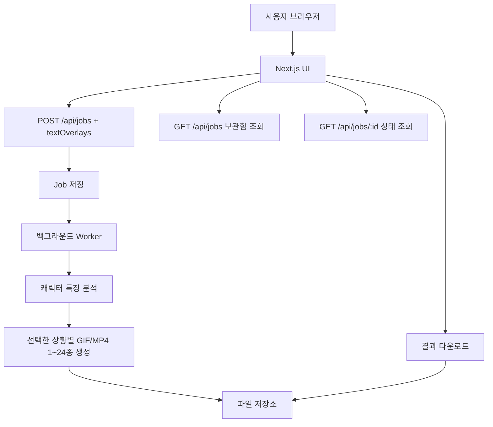
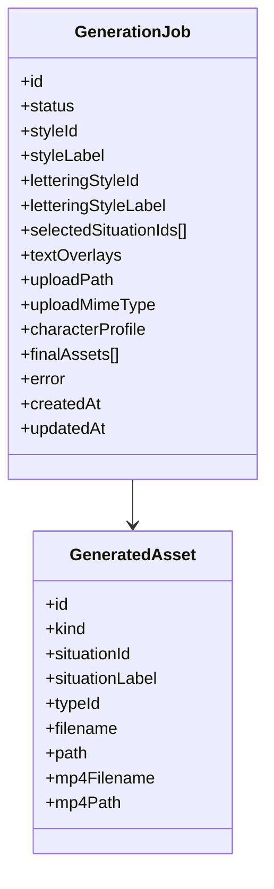
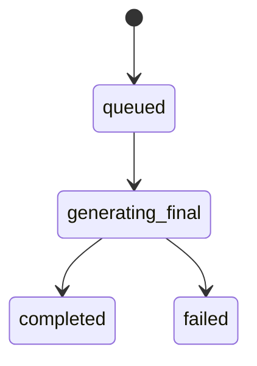

# Imoji 설계 문서

## 1. 설계 목표
이 서비스의 설계 목표는 다음과 같다.
- 사용자가 최소 입력만으로 이모티콘 세트를 생성할 수 있게 한다.
- 원본 스케치의 캐릭터 정체성을 유지한다.
- 생성 과정은 비동기로 처리해 사용자가 대기 상태를 확인할 수 있게 한다.
- 최종 결과물은 사용자가 선택한 1~24개의 320×320 투명 배경 GIF 파일과 동일 애니메이션의 흰 배경 MP4 파일을 ZIP 다운로드 형태로 제공한다.
- 사용자가 상황별 문구의 위치, 회전, 크기, 색상을 직접 조정할 수 있게 한다.
- 생성 화면과 보관함을 상단 메뉴로 분리해, 제작 흐름과 과거 결과 조회 흐름을 명확히 구분한다.

## 2. 상위 아키텍처
현재 구조는 단순한 웹 앱 + API + 로컬 작업 저장소 + 백그라운드 생성 워커 형태다.



## 3. 처리 흐름
### 3.1 작업 생성
1. 사용자가 스케치 파일을 업로드한다.
2. 사용자가 스타일을 선택한다.
3. 사용자가 필요하면 상황별 문구를 선택하고, 캔버스에서 위치/회전/크기/색상을 조정한다.
4. 클라이언트가 스케치, 스타일, 선택 상황, `textOverlays`를 FormData로 작업 생성 API에 전달한다.
5. 서버는 입력값과 업로드 파일, 텍스트 오버레이 설정을 검증한다.
6. 서버는 job 정보를 저장하고 작업 상태를 `queued`로 만든다.
7. 워커가 대기열에서 작업을 가져간다.

관련 구현:
- [app/page.tsx](app/page.tsx)
- [app/api/jobs/route.ts](app/api/jobs/route.ts)
- [lib/jobs.ts](lib/jobs.ts)

### 3.2 캐릭터 프로필 분석
1. 워커는 업로드 이미지를 읽는다.
2. Vision 모델이 스케치에서 캐릭터의 시각적 특징을 텍스트 프로필로 요약한다.
3. 이 프로필은 이후 선택한 모든 이모티콘 생성의 공통 기준으로 사용된다.

핵심 목적:
- 캐릭터 재해석을 최소화
- 원본 스케치의 개성을 유지
- 여러 상황 이미지에서도 동일 캐릭터로 인식되게 함

관련 구현:
- [lib/characterProfile.ts](lib/characterProfile.ts)
- [lib/worker.ts](lib/worker.ts)

### 3.3 상황별 GIF 생성
1. 시스템은 사용자가 선택한 1~24개 상황 목록을 순회한다.
2. 각 상황마다 `업로드 원본 이미지 + 캐릭터 프로필 + 스타일 프롬프트 + 상황 프롬프트 + 16프레임 액션`을 함께 모델 입력으로 전달한다.
3. 기본 생성 모드인 `image_reference_sprite`는 업로드 이미지를 `inlineData` reference image로 직접 넣어 같은 캐릭터의 4×4 스프라이트 시트를 생성한다.
4. 모델 출력에는 글자를 넣지 않고, 16칸 전체를 애니메이션 프레임으로 사용한다.
5. 후처리 스크립트가 스프라이트 시트를 패널별로 분리하고, foreground 기반으로 캐릭터 중심/크기/여백을 정규화한다.
6. 정렬된 16개 프레임에 한국어 라벨을 직접 오버레이한다. 사용자가 커스텀 문구를 지정한 상황은 저장된 `textOverlays`의 좌표/회전/크기/색상을 사용하고, 기본 모드는 상황별 추천 문구를 사용한다.
7. 후처리 결과를 투명 배경의 320×320 GIF로 변환한다.
8. API 키가 없거나 `GENERATION_MODE=source_motion`인 경우에만 원본 이미지 crop/transform 기반 preview fallback을 사용한다.
9. 생성된 GIF를 같은 애니메이션의 320×320 MP4로 변환한다.
10. 생성된 GIF와 MP4를 작업 디렉터리에 저장한다.

관련 구현:
- [lib/prompts.ts](lib/prompts.ts)
- [lib/generator.ts](lib/generator.ts)
- [lib/constants.ts](lib/constants.ts)
- [data/situations.json](../data/situations.json)

### 3.4 결과 제공
1. 클라이언트는 주기적으로 작업 상태를 조회한다.
2. 클라이언트는 상단 메뉴의 `/archive` 보관함 페이지에서 `GET /api/jobs`로 과거 생성 작업 목록을 불러온다.
3. 보관함은 최신순 목록을 페이지 단위로 표시하고, 각 행을 펼쳐 완료된 GIF 썸네일을 확인할 수 있게 한다.
4. 작업이 완료되면 생성 화면에서도 선택한 개수만큼의 GIF 목록을 표시한다.
5. 사용자는 GIF와 MP4가 함께 들어있는 ZIP을 다운로드하거나, 보관함에서 이전 작업을 다시 열어 확인한다.

관련 구현:
- [app/page.tsx](app/page.tsx)
- [app/archive/page.tsx](app/archive/page.tsx)
- [app/api/jobs/[jobId]/route.ts](app/api/jobs/[jobId]/route.ts)
- [app/api/jobs/[jobId]/download/route.ts](app/api/jobs/[jobId]/download/route.ts)

## 4. 데이터 모델
현재 핵심 엔티티는 GenerationJob 하나로 단순화할 수 있다.



관련 타입:
- [lib/types.ts](lib/types.ts)

## 5. 상태 전이
작업 상태는 비교적 단순한 상태 머신으로 볼 수 있다.



의미:
- `queued`: 작업이 생성되었고 처리 대기 중
- `generating_final`: 캐릭터 분석 및 최종 GIF 생성 중
- `completed`: 선택한 결과물 생성 완료
- `failed`: 생성 실패

## 6. 저장 구조
작업 단위로 파일 시스템에 저장하는 구조를 사용한다.

예시:
```text
storage/
  jobs/
    {jobId}/
      uploads/
        sketch.png
      final/
        emoticon_01_hello.gif
        emoticon_01_hello.mp4
        ...
      tmp/
      job.json
```

의도:
- 구현 단순화
- 작업별 산출물 분리
- 장애 시 개별 작업 추적 용이

관련 구현:
- [lib/storage.ts](lib/storage.ts)

## 7. 프롬프트 설계 원칙
프롬프트는 단순히 예쁜 이미지를 만드는 것이 아니라, 업로드 이미지를 직접 reference로 사용해 동일 캐릭터 유지가 최우선이 되도록 설계한다.

핵심 원칙:
- 업로드 이미지를 모델 입력의 `inlineData`로 포함한다.
- 원본 캐릭터를 재설계하지 않는다.
- 캐릭터의 실루엣과 비율을 유지한다.
- 상황 표현은 달라져도 캐릭터 동일성은 유지한다.
- GIF 내부 프레임은 동일한 카메라 거리, 캐릭터 중심, 크기를 유지하도록 요청한다.
- 모델 생성물에는 글자를 넣지 않고, 한국어 라벨은 후처리에서 직접 오버레이한다.
- 커스텀 문구가 있는 경우에도 모델 프롬프트에 글자를 요구하지 않고, 후처리 단계에서만 위치/회전/크기/색상을 적용한다.
- 최종 GIF는 투명 배경으로 저장하고, MP4는 투명 영역을 흰색으로 합성해 저장한다.

상황별 문구와 액션은 `data/situations.json`에서 관리한다.
각 상황은 UI 선택용 `label`, GIF 오버레이 후보인 `textVariants`, 기본 `prompt`, 전체 `animationPrompt`, 16개 프레임 지시인 `frames`를 가진다.
`label`은 "슬픔" 같은 분류명이고, 실제 GIF에는 `textVariants` 중 하나인 "마상...", "오늘 좀 흐림" 같은 표현을 사용한다.
16프레임은 여러 동작을 나열하지 않고, 상황별 핵심 액션 하나를 `rest -> tiny anticipation -> action peak -> soft rebound -> rest` 흐름으로 반복한다.
마지막 프레임은 첫 프레임과 자연스럽게 이어져야 하며, 한 GIF 안에서 컷 전환이나 두 번째 액션을 시작하지 않는다.

## 8. 프레임 좌표 보정
스프라이트 변환 단계는 모델이 만든 4×4 패널 전체의 흔들림을 줄이기 위해 자동 보정을 수행한다.

핵심 방식:
- 4×4 스프라이트 전체 16칸을 읽기 순서대로 자른다.
- 흰색/투명 배경을 제외한 foreground mask를 만든다.
- 중앙에 가깝고 면적이 큰 연결 요소를 캐릭터 후보로 잡는다.
- 16개 프레임의 캐릭터 중심과 높이 중앙값을 기준 anchor로 사용한다.
- 각 프레임을 동일 320×320 캔버스에 scale/translate해 캐릭터 좌표와 여백을 통일한다.
- raw sprite, split frame, normalized frame, labeled frame debug 이미지를 `tmp` 하위에 저장해 품질 확인이 가능하게 한다.
- 사용자 텍스트 오버레이는 320×320 기준 좌표계로 저장하고, 각 정규화 프레임 위에 회전된 투명 레이어로 합성한다.
- 최종 GIF 저장 직전 배경 픽셀만 투명 인덱스로 매핑하고, 이 GIF를 흰 배경에 합성해 MP4를 생성한다.

## 9. 운영 관점 설계 포인트
### 9.1 장점
- 구조가 단순해 빠르게 프로토타이핑 가능
- Job 단위 저장으로 디버깅이 쉬움
- 프롬프트/스타일 변경이 비교적 단순함

### 9.2 한계
- 현재는 단일 프로세스 워커 구조라 확장성이 제한적일 수 있음
- 파일 시스템 저장 방식은 다중 서버 환경에 바로 적합하지 않을 수 있음
- 생성 시간이 길어질수록 사용자 체감 대기 시간이 커질 수 있음

## 10. 향후 확장 방향
- 큐 시스템 분리로 비동기 처리 안정화
- 스토리지를 S3 같은 외부 저장소로 전환
- 스타일 프리셋과 문구 프리셋의 운영 관리 기능 추가
- 결과물 검수/재생성 기능 추가
- 카카오 이모티콘 규격 검사 자동화
