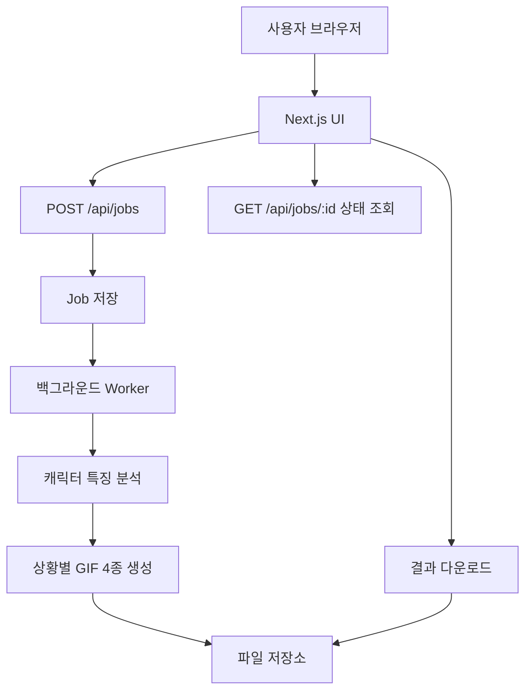
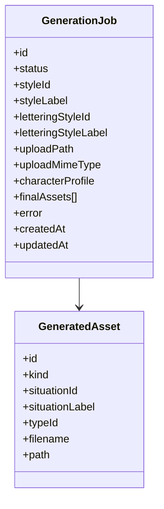
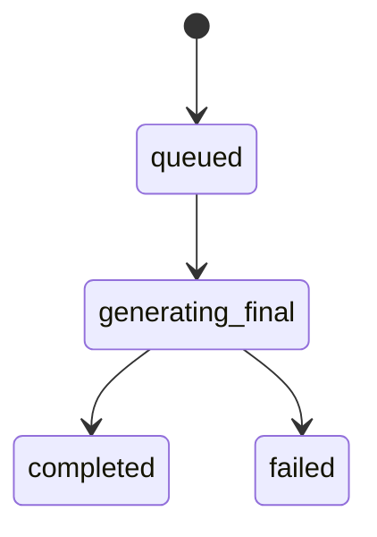

# Imoji 설계 문서

## 1. 설계 목표
이 서비스의 설계 목표는 다음과 같다.
- 사용자가 최소 입력만으로 이모티콘 세트를 생성할 수 있게 한다.
- 원본 스케치의 캐릭터 정체성을 유지한다.
- 생성 과정은 비동기로 처리해 사용자가 대기 상태를 확인할 수 있게 한다.
- 최종 결과물은 4개의 320×320 GIF 파일과 ZIP 다운로드 형태로 제공한다.

## 2. 상위 아키텍처
현재 구조는 단순한 웹 앱 + API + 로컬 작업 저장소 + 백그라운드 생성 워커 형태다.



## 3. 처리 흐름
### 3.1 작업 생성
1. 사용자가 스케치 파일을 업로드한다.
2. 사용자가 스타일을 선택한다.
3. 클라이언트가 FormData로 작업 생성 API를 호출한다.
4. 서버는 입력값과 업로드 파일을 검증한다.
5. 서버는 job 정보를 저장하고 작업 상태를 `queued`로 만든다.
6. 워커가 대기열에서 작업을 가져간다.

관련 구현:
- [app/page.tsx](app/page.tsx)
- [app/api/jobs/route.ts](app/api/jobs/route.ts)
- [lib/jobs.ts](lib/jobs.ts)

### 3.2 캐릭터 프로필 분석
1. 워커는 업로드 이미지를 읽는다.
2. Vision 모델이 스케치에서 캐릭터의 시각적 특징을 텍스트 프로필로 요약한다.
3. 이 프로필은 이후 4개 이모티콘 생성의 공통 기준으로 사용된다.

핵심 목적:
- 캐릭터 재해석을 최소화
- 원본 스케치의 개성을 유지
- 여러 상황 이미지에서도 동일 캐릭터로 인식되게 함

관련 구현:
- [lib/characterProfile.ts](lib/characterProfile.ts)
- [lib/worker.ts](lib/worker.ts)

### 3.3 상황별 GIF 생성
1. 시스템은 미리 정의된 4개 상황 목록을 순회한다.
2. 각 상황마다 `캐릭터 프로필 + 스타일 프롬프트 + 상황 프롬프트`를 합쳐 생성 프롬프트를 만든다.
3. 이미지 생성 모델이 2×2 스프라이트 시트를 만든다.
4. 후처리 스크립트가 스프라이트 시트를 320×320 GIF로 변환한다.
5. 생성된 GIF를 작업 디렉터리에 저장한다.

관련 구현:
- [lib/prompts.ts](lib/prompts.ts)
- [lib/generator.ts](lib/generator.ts)
- [lib/constants.ts](lib/constants.ts)

### 3.4 결과 제공
1. 클라이언트는 주기적으로 작업 상태를 조회한다.
2. 작업이 완료되면 4개 GIF 목록을 표시한다.
3. 사용자는 결과를 ZIP으로 다운로드한다.

관련 구현:
- [app/page.tsx](app/page.tsx)
- [app/api/jobs/[jobId]/route.ts](app/api/jobs/[jobId]/route.ts)
- [app/api/jobs/[jobId]/download/route.ts](app/api/jobs/[jobId]/download/route.ts)

## 4. 데이터 모델
현재 핵심 엔티티는 GenerationJob 하나로 단순화할 수 있다.



관련 타입:
- [lib/types.ts](lib/types.ts)

## 5. 상태 전이
작업 상태는 비교적 단순한 상태 머신으로 볼 수 있다.



의미:
- `queued`: 작업이 생성되었고 처리 대기 중
- `generating_final`: 캐릭터 분석 및 최종 GIF 생성 중
- `completed`: 4개 결과물 생성 완료
- `failed`: 생성 실패

## 6. 저장 구조
작업 단위로 파일 시스템에 저장하는 구조를 사용한다.

예시:
```text
storage/
  jobs/
    {jobId}/
      uploads/
        sketch.png
      final/
        emoticon_01_hello.gif
        ...
      tmp/
      job.json
```

의도:
- 구현 단순화
- 작업별 산출물 분리
- 장애 시 개별 작업 추적 용이

관련 구현:
- [lib/storage.ts](lib/storage.ts)

## 7. 프롬프트 설계 원칙
프롬프트는 단순히 예쁜 이미지를 만드는 것이 아니라, 동일 캐릭터 유지가 최우선이 되도록 설계한다.

핵심 원칙:
- 원본 캐릭터를 재설계하지 않는다.
- 캐릭터의 실루엣과 비율을 유지한다.
- 상황 표현은 달라져도 캐릭터 동일성은 유지한다.
- 글자는 손글씨 느낌으로 보조적으로 배치한다.
- 배경은 단순하게 유지한다.

## 8. 운영 관점 설계 포인트
### 8.1 장점
- 구조가 단순해 빠르게 프로토타이핑 가능
- Job 단위 저장으로 디버깅이 쉬움
- 프롬프트/스타일 변경이 비교적 단순함

### 8.2 한계
- 현재는 단일 프로세스 워커 구조라 확장성이 제한적일 수 있음
- 파일 시스템 저장 방식은 다중 서버 환경에 바로 적합하지 않을 수 있음
- 생성 시간이 길어질수록 사용자 체감 대기 시간이 커질 수 있음

## 9. 향후 확장 방향
- 큐 시스템 분리로 비동기 처리 안정화
- 스토리지를 S3 같은 외부 저장소로 전환
- 스타일 프리셋과 문구 프리셋의 운영 관리 기능 추가
- 결과물 검수/재생성 기능 추가
- 카카오 이모티콘 규격 검사 자동화
