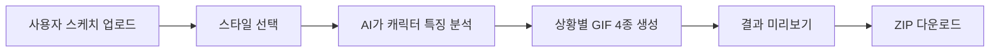

# Imoji 요구사항 문서

## 1. 개요
Imoji는 사용자가 업로드한 간단한 캐릭터 스케치를 바탕으로, 카카오톡에서 사용할 수 있는 320×320 GIF 이모티콘 4종을 AI로 자동 생성하는 웹서비스다.

핵심 가치는 다음과 같다.
- 사용자는 정교한 원화 없이 연필 스케치만으로 결과물을 얻을 수 있다.
- 서비스는 업로드된 스케치의 고유한 캐릭터성을 최대한 유지해야 한다.
- 사용자는 몇 번의 선택만으로 상황별 이모티콘 세트를 빠르게 생성할 수 있어야 한다.

## 2. 목표
- 사용자가 캐릭터 윤곽 스케치 1장을 업로드하면 이모티콘 4종을 자동 생성한다.
- 결과물은 320×320 크기의 GIF 포맷으로 제공한다.
- 사용자가 선택한 스타일에 맞게 전체 톤앤매너를 반영한다.
- 원본 스케치의 실루엣, 비율, 표정 위치, 개성 있는 비대칭 등 캐릭터 정체성을 유지한다.

## 3. 주요 사용자
### 3.1 대상 사용자
- 직접 캐릭터를 그리지만 디지털 일러스트 완성본 제작은 어려운 사용자
- 빠르게 카카오톡용 감정 표현 세트를 만들고 싶은 개인 창작자

### 3.2 사용자 입력
- 캐릭터의 윤곽만 있는 간단한 손그림 스케치 파일
- 원하는 이모티콘 스타일 1종 선택
- 필요 시 글자 표현 스타일 선택

## 4. 기능 요구사항
### 4.1 파일 업로드
- 사용자는 스케치 이미지 파일 1개를 업로드할 수 있어야 한다.
- 지원 포맷은 이미지 파일이어야 한다.
- 업로드 파일은 서비스에서 생성의 기준 이미지로 사용된다.

### 4.2 스타일 선택
- 사용자는 미리 정의된 스타일 중 1개를 선택할 수 있어야 한다.
- 스타일은 총 6가지를 기준으로 기획한다.
- 각 스타일은 생성 프롬프트에 반영되어 결과물의 시각적 톤을 결정한다.

예시 스타일 범주:
- 말랑 2D 스티커
- 깔끔한 라인 캐릭터
- 귀여운 SD/치비
- 손그림 수채화
- 클레이/토이 느낌
- 픽셀 아트

### 4.3 캐릭터 특성 유지
- 서비스는 업로드 이미지를 분석해 캐릭터의 핵심 특징을 추출해야 한다.
- 이후 모든 생성 결과물은 이 특징을 공통 기준으로 사용해야 한다.
- 생성 과정에서 원본과 무관한 새로운 캐릭터로 변형되면 안 된다.

유지 대상 예시:
- 실루엣
- 얼굴 배치
- 눈/입 위치와 인상
- 몸 비율
- 손그림 특유의 삐뚤함이나 개성
- 액세서리나 외형 특징

### 4.4 상황별 이모티콘 생성
- 서비스는 하나의 캐릭터로 4가지 상황별 이모티콘을 생성해야 한다.
- 각 결과물은 서로 다른 감정/상황을 표현하되 동일 캐릭터로 인식되어야 한다.

기본 상황 예시:
- 안녕
- 좋아해
- 깜짝
- ㅋㅋㅋ

### 4.5 결과물 제공
- 생성 완료 후 사용자는 4개의 GIF 결과물을 확인할 수 있어야 한다.
- 사용자는 전체 결과물을 ZIP으로 다운로드할 수 있어야 한다.

## 5. 비기능 요구사항
### 5.1 사용성
- 업로드 → 스타일 선택 → 생성 → 다운로드 흐름이 단순해야 한다.
- 생성 중 상태를 사용자가 확인할 수 있어야 한다.

### 5.2 일관성
- 4개 결과물 모두 동일 캐릭터처럼 보여야 한다.
- 선택한 스타일과 문구 표현 방식이 세트 전체에 일관되게 반영되어야 한다.

### 5.3 품질
- 작은 크기에서도 캐릭터와 문구가 식별 가능해야 한다.
- 배경은 단순해야 하며 이모티콘 본체의 가독성을 해치면 안 된다.

## 6. 사용자 흐름

## 7. 범위 정리
### 포함 범위
- 단일 스케치 업로드
- 스타일 선택 기반 생성
- 4종 GIF 이모티콘 자동 생성
- 다운로드 제공

### 제외 범위
- 사용자별 프로젝트 관리 기능
- 편집기 수준의 수동 보정 기능
- 장문의 프롬프트를 사용자가 직접 작성하는 기능
- 카카오 이모티콘 심사/등록 자동화

## 8. 향후 설계 시 확인할 질문
- 스타일 6가지를 고정 제공할지, 운영자가 추가 가능한 구조로 할지
- 생성 실패 시 재시도 정책을 어떻게 둘지
- 생성 시간과 비용을 줄이기 위해 어떤 캐싱/큐 전략이 필요한지
- 최종 결과물의 카카오 업로드 규격 검증을 어디까지 자동화할지
